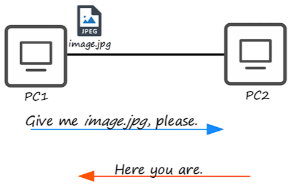
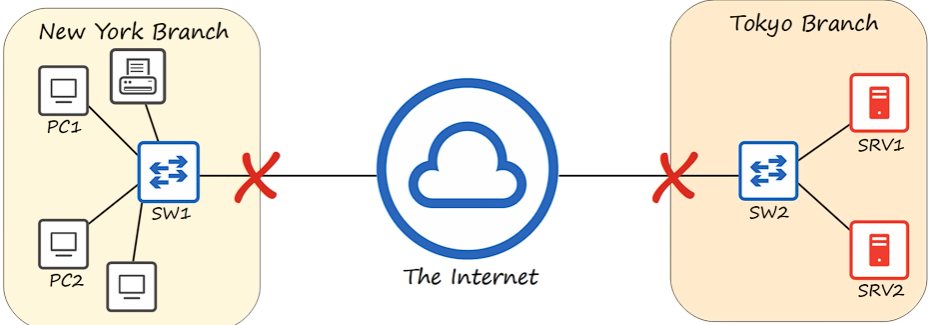
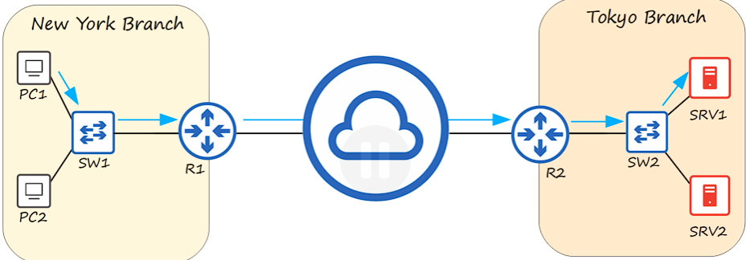
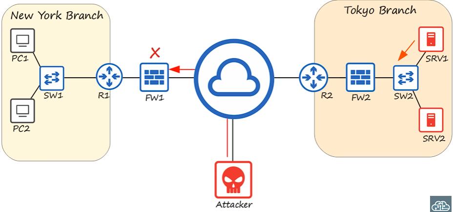

# Network Devices

[Source: Day 1 | Network Devices](https://youtu.be/H8W9oMNSuwo?si=5KIqb554raFcF27N)

> Quiz starts at 22:27

## What is a Network?

A computer network is a digital telecommunications network which allow NODES to share RESOURCES.  
Essentially allowing NODES to have a conversation with each others.
NODES includes Router, Switch, Firewall, Server, and Client. 

### 1. Client (End Host)

A client is a device that accesses a service made available by a server. 

### 2. Server (End Host)

A server is a device that provides functions or services for clients.

### # Example of Server and Clients

PC1 is the Client and PC2 is the Server.

### 3. Switch

1. usually have many network interfaces/ports for end hosts (usually 24+).
2. provide connectivity to hosts within the same LAN
3. do not provide connectivity between LANs or over the internet

### 4. Router

1. have fewer network interfaces than switches.
2. are used to provide connectivity between LANs.
3. are therefore used to send data over the Internet.

### 5. Firewall

1. monitor and control network traffic based on configured rules.
2. can be placed 'inside' or 'outside' the network   (after passing router vs before reaching router).
3. are known as 'next-generation firewalls' when they include more modern and advanced filtering capabilites.

#### # Network firewalls? are hardware devices that filter traffic between networks.
#### # Host-based firewalls? are software app that filter traffic entering and exiting host machine (e.g. PC).

