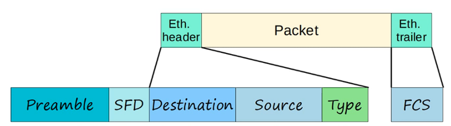
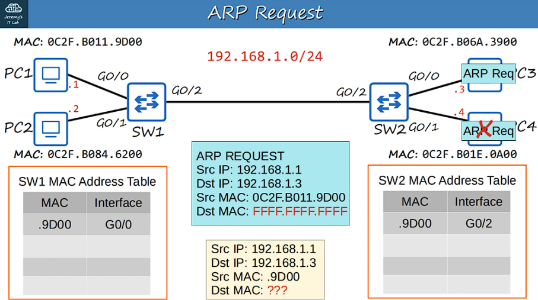
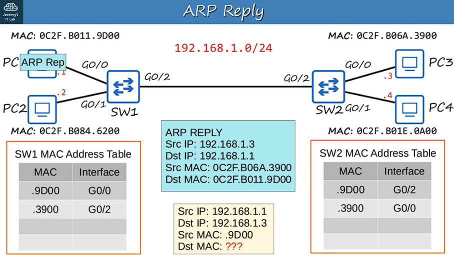
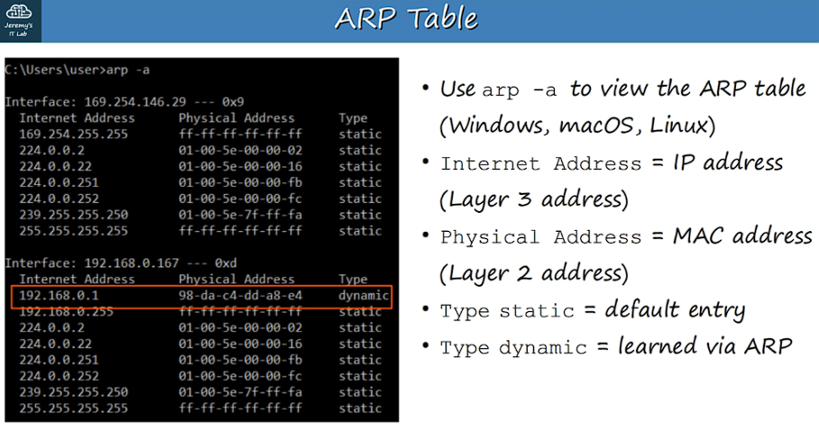
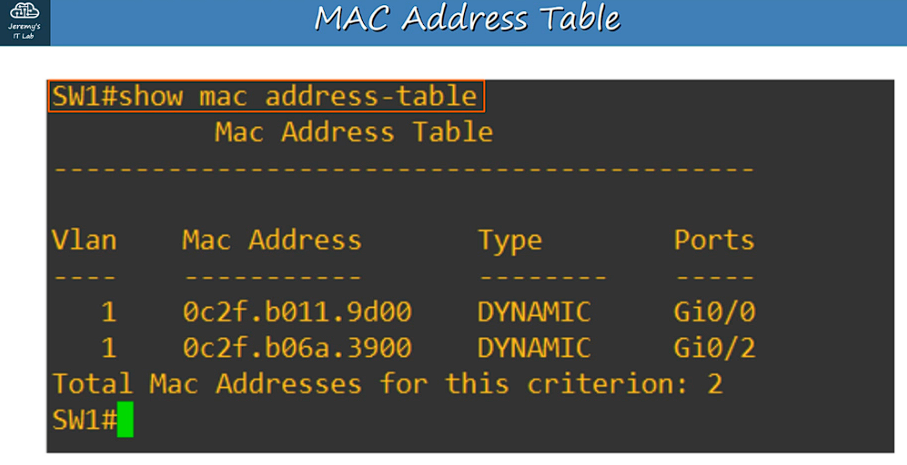
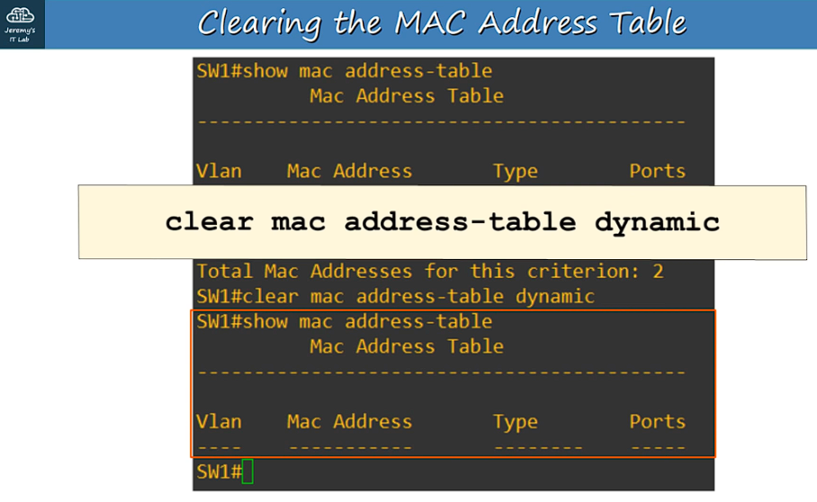

[Return to README](../README.md)

# 6. ETHERNET LAN SWITCHING : PART 2

An ETHERNET FRAME looks like:

Ethernet Header --- DATA (Packet) --- Ethernet Trailer

The Ethernet Header contains 5 Fields:

Preamble -- SFD -- Destination -- Source -- Type/Length
7 bytes  -- 1 byte -- 6 bytes -- 6 bytes --   2 bytes

Ethernet Trailer contains 1 Field:

FCS (Frame Check Sequence) = 4 bytes

- The PREAMBLE + SFD is not usually considered part of the ETHERNET HEADER.

THEREFORE the size of the ETHERNET HEADER + TRAILER is 18 bytes

(6 + 6 + 2 + 4 bytes for the FRAME CHECK SEQUENCE)

---

The MINIMUM size for an ETHERNET FRAME (Header + Payload [PACKET] + Trailer) is 64 BYTES.

64 BYTES - 18 BYTES (Header + Trailer size) = 46 BYTES

THEREFORE the MINIMUM DATA PAYLOAD (PACKET) size is 46 BYTES!

IF the PAYLOAD is LESS than 46 BYTES then PADDING BYTES are added (padding bytes are a series of 0's) until it equals to 46 BYTES.

---

When a PC wants to send a packet to a destination, with a known IP address but an unknown MAC address, it first needs to send an ARP Request to learn that destination's MAC address.

- ARP stands for 'Address Resolution Protocol'.
- It is used to discover the Layer 2 address (MAC address) of a known Layer 3 address (IP address)
- Consists of two messages:
    - ARP REQUEST (Source message)
    - ARP REPLY (Destination message)
- ARP REQUEST is BROADCAST = sent to all hosts on network, except the one it received the request from.

An ARP REQUEST frame has:

- Source IP Address
- Destination IP Address
- Source MAC address
- BROADCAST MAC Address - FFFF.FFFF.FFFF

An ARP REPLY frame has:

- Source IP Address
- Destination IP Address
- Source MAC address
- Destination MAC Address

ARP REPLY is a known UNICAST frame = Sent only to the host that sent the ARP REQUEST.

---

PING

- A network utility that is used to test reachability
- Measures round-trip time
- Uses two messages:
    - ICMP Echo REQUEST
    - ICMP Echo REPLY
- Is UNICAST
- Command to use ping:
    - ping <ip-address>

By Default, a CISCO IOS sends 5 ICMP requests/replies
(Default size is 100-bytes)

- A period (.) is a failed ping
- An exclamation mark (!) is a successful ping

---

USEFUL CISCO IOS COMMANDS (from Privileged EXEC mode)

`PC1# show arp` // shows hosts ARP table

---

`SW1#show mac address-table` // show the switches MAC table

Will show:

Vlan --- MAC Address --- Type --- Ports(interfaces)

(Vlan = Virtual Local Area Network)

---

`SW1# clear mac address-table dynamic` <optional MAC address>

// clears the entire switches MAC table.
// IF the optional MAC address is used, it will clear the **SPECIFIC MAC** address.

`SW1#clear mac address-table dynamic interface` <optional Interface>

// clears the MAC table entry of the Switch by it's **INTERFACE** name.